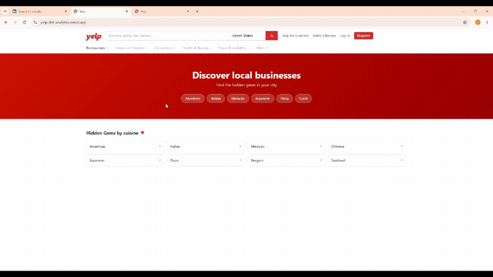

# Yelp Hidden Gems: Analytics Engineering Pipeline

An end-to-end analytics engineering project built on the [Yelp Open Dataset](https://www.yelp.com/dataset), surfacing underrated restaurants through NLP-powered scoring and a live interactive dashboard.

**[Live demo](https://yelp-dbt-analytics.vercel.app)**

---

## Live app



*Landing page showing cuisine-based discovery. Select a cuisine to browse restaurants ranked by hidden gem score, with filters for minimum stars, review count, and price range.*

---

## What it does

Most restaurant rankings reward volume: the more reviews, the higher the visibility. This project flips that logic by scoring restaurants on how positively people *write* about them relative to how many reviews they have, surfacing places with genuine potential before the crowds arrive.

The core metric, the hidden gem score, uses [VADER](https://github.com/cjhutto/vaderSentiment) sentiment on review text rather than star ratings (text is harder to game than a number) and penalizes popularity through a log denominator so high-sentiment places with fewer reviews rise above equally-rated but heavily-reviewed ones.

```sql
CASE
  WHEN review_count >= 20 AND avg_sentiment IS NOT NULL
  THEN round(avg_sentiment / ln(review_count + 2), 4)
END
```

The 20-review minimum filters out businesses where friends and family skew the signal.

---

## Pipeline


---

## Stack

| Layer | Technology |
|---|---|
| Warehouse | [DuckDB](https://duckdb.org/) |
| Transformations | [dbt Core](https://docs.getdbt.com/) |
| NLP | [VADER](https://github.com/cjhutto/vaderSentiment) (offline, pre-computed) |
| Frontend | [React 18](https://react.dev/), [Vite](https://vitejs.dev/), [Tailwind CSS](https://tailwindcss.com/) |
| Deployment | [Vercel](https://vercel.com/) |

---

## Key design decisions

**Sentiment over stars:** VADER compound scores aggregate across thousands of reviews per business, diluting irony and sarcasm at scale. Star ratings are more susceptible to coordinated manipulation.

**Log denominator:** `ln(review_count + 2)` grows slowly, meaning a place with 25 reviews and 0.85 sentiment scores higher than one with 500 reviews and the same sentiment. Popularity is penalized, not rewarded.

**Pre-computed NLP:** All sentiment scoring runs offline during ingestion. Zero production latency on the dashboard.

**Static JSON export:** No backend or API in production. [dbt](https://docs.getdbt.com/) marts are exported to two JSON files (grouped by cuisine) and served as static assets, keeping the deployment simple and free.

---

## Key findings

| Metric | Value |
|---|---|
| Restaurants in pipeline | 52K |
| Reviews scored with VADER | 4.7M |
| Restaurants qualifying for a hidden gem score | 34,425 |
| Top city by gem count | Philadelphia, PA, with 3,936 gems |
| Top cuisine by sentiment | Vegan/Vegetarian (avg 0.97) |
| Bottom cuisine by sentiment | Burgers (avg 0.72) |

**Sentiment stabilizes at scale.** Restaurants with fewer than 10 reviews show a sentiment standard deviation of 0.34, nearly 3× higher than the 0.12 seen in restaurants with 200+ reviews. This is the empirical basis for the 20-review minimum: below that threshold, scores are too noisy to be meaningful.

**Top gems cluster at the review floor.** All 10 highest-scoring restaurants sit between 20 and 21 reviews, each carrying over 95% positive sentiment. The top scorer, Café BellaVita in Merchantville, NJ, reaches a 96.2% sentiment score across exactly 20 reviews, a score that would drop significantly after gaining 200 more reviews at the same sentiment level.

**American restaurants dominate by count but not by quality.** With 11,838 restaurants, American cuisine is the largest category in the dataset, yet its average hidden gem score (0.80) ranks near the bottom. Vegan/Vegetarian (687 restaurants) leads by a wide margin, suggesting that specialized cuisines attract more intentional, satisfied diners.

---

## Project structure

```
├── ingestion/
│   ├── load_to_duckdb.py     # loads raw Yelp JSON into DuckDB
│   ├── run_vader.py          # scores 4.7M reviews with VADER
│   └── export_data.py        # exports mart data to JSON for the dashboard
├── yelp_transform/           # dbt project
│   └── models/
│       ├── staging/          # stg_business, stg_review, stg_tip
│       ├── intermediate/     # int_business_sentiment
│       └── marts/            # mart_restaurants, mart_cuisine_summary
├── dashboard/                # React app (deployed on Vercel)
├── exploration/              # ad-hoc scripts used to validate score design
└── data/                     # DuckDB and raw JSON (excluded from git, too large)
```

---

## Data

[Yelp Open Dataset](https://www.yelp.com/dataset) — used under Yelp's academic dataset terms (non-commercial).

7M reviews across 150K businesses in the full dataset. Pipeline restricted to restaurant categories, covering 52K businesses and 4.7M reviews scored.
